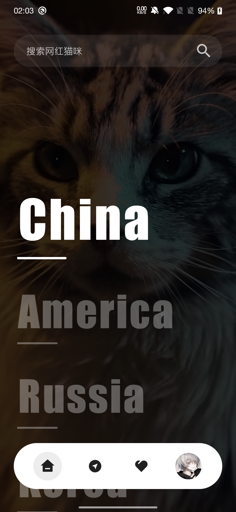
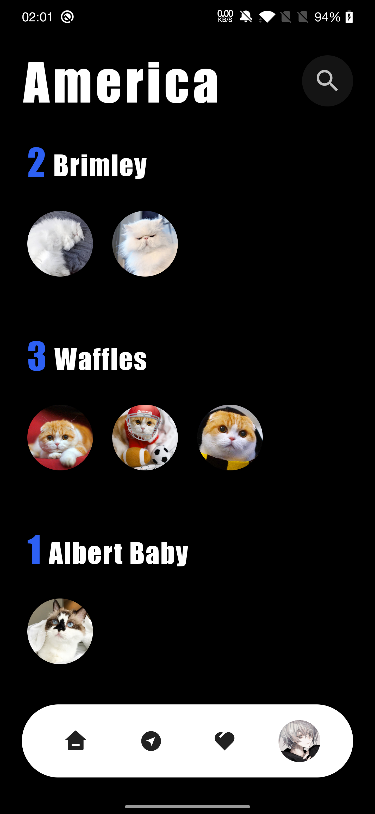
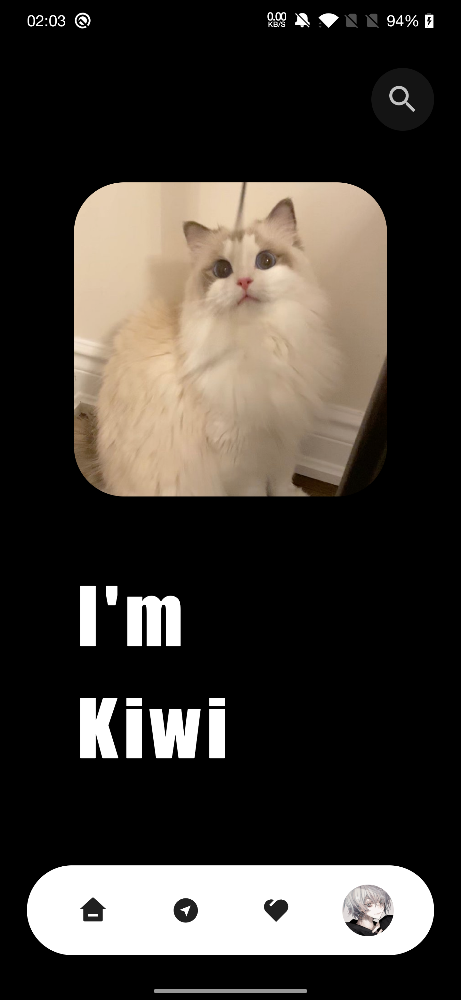
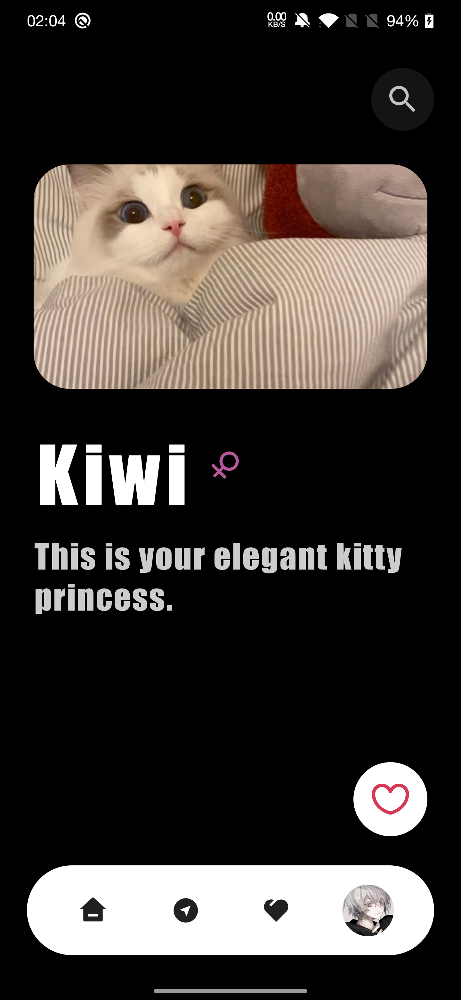

# This is the Compose world that belongs to the kitties

## 🙌 Description
A Compose Kitty App sample with exquisite ui and animation effects.


## 🌟 Motivation and Context
Although many people use material design to complete their works very well, I prefer to try other different styles!
And I am very interested in exploring various APIs of Jetpack Compose, so it was created.


## 🎬 Screenshots
Home | Gallery | Details | Details (Expanded)
--- | --- | --- | --- |
 |  |  | 

<br />


## 🐱 Note

Although it is already cool from the screenshots and screen recordings, it is actually an unfinished work. Due to time issues, I will optimize and complete this project in my spare time (because some parts of the current The code is really bad!)
In addition, I will integrate it with [TheCatApi](https://thecatapi.com/) and a series of popular libraries to complete the function of discovering cats, and more...
Finally, 猫猫什么的，我最喜欢了！


## 💖 Credits

- Inspired by [golota_eg](https://dribbble.com/shots/7944546-Ticket-app-Prototype)
- Transition of the details page by [compose-shared-elements](https://github.com/mxalbert1996/compose-shared-elements)
- Some code help by [toolkit](https://github.com/MeowBase/toolkit)
  

## License
```
Copyright 2020 The Android Open Source Project
Copyright 2021 RinOrz (凛)

Licensed under the Apache License, Version 2.0 (the "License");
you may not use this file except in compliance with the License.
You may obtain a copy of the License at

    https://www.apache.org/licenses/LICENSE-2.0

Unless required by applicable law or agreed to in writing, software
distributed under the License is distributed on an "AS IS" BASIS,
WITHOUT WARRANTIES OR CONDITIONS OF ANY KIND, either express or implied.
See the License for the specific language governing permissions and
limitations under the License.
```